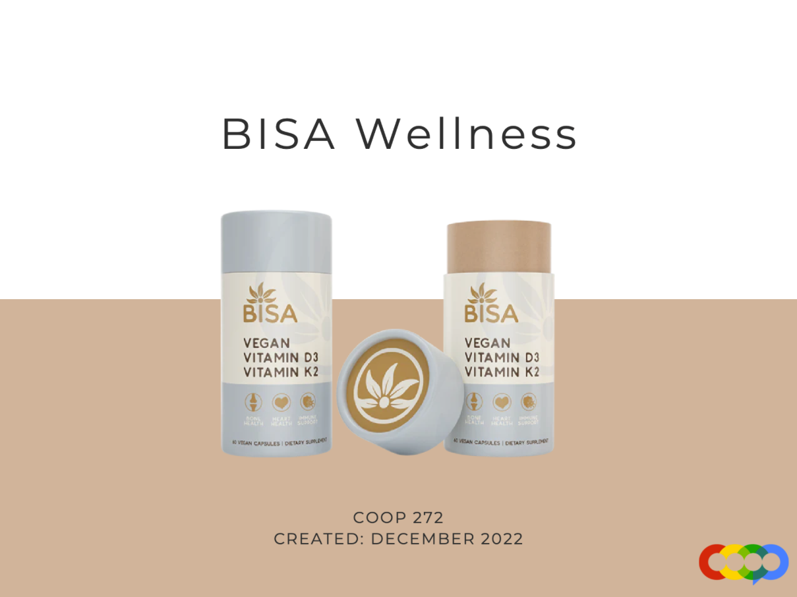
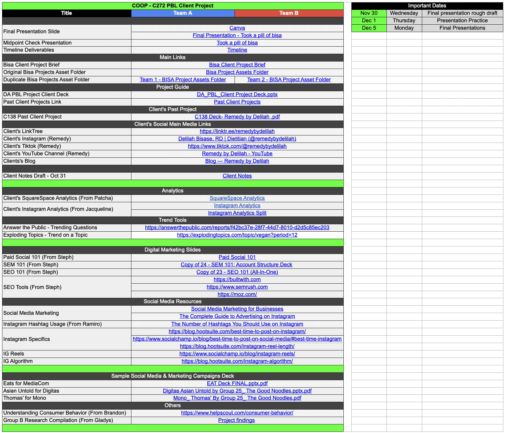

# Bisa-Wellness
### Data and Marketing Analytics Project (2022) - COOP Careers

Analyzed social media data and provided digital marketing strategies with 17 COOPers, aimed to solidify a successful product launch and market an eco-friendly and sustainable product, supplementing its current social media presence and business

---
### Repository Contents:
* [Bisa Wellness Presentation by C272](https://github.com/angeloparayno/Bisa-Wellness/blob/main/Bisa-Wellness-C272.pdf)
* [Bisa Wellness C272 Project Managment Dashboard](https://github.com/angeloparayno/Bisa-Wellness/blob/main/Bisa-Wellness-Project-Dashboard-C272.xlsx)
  * Main Links to all resources
  * Team A Deliverables
  * Team B Deliverables
  * Client's Color Scheme (Hex/RGB/CYMK table)
  * Tableau Guide
---

---
#### Sample Dashboard Image View (*click to direct to the actual Google Sheet page*)

